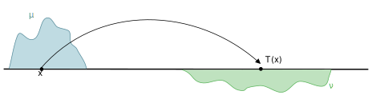

My main research interests are **Optimal Transport** theory and its applications to different areas of Mathematical Analysis. I am interested in evolutions problems in the space of measures, in the generalization of Optimal Transport theory to the broader setting of positive measures and in the study of Metric Sobolev spaces on spaces of measures.

### Journal papers

1. M. Fornasier, P. Heid, G. E. Sodini. **Approximation Theory, Computing, and Deep Learning on the Wasserstein Space**. Accepted for publication in Mathematical Models and Methods in Applied Sciences [Preprint](https://cvgmt.sns.it/media/doc/paper/6265/fhs_23.pdf)

2. G. Savaré, G. E. Sodini. **A relaxation viewpoint to Unbalanced Optimal Transport: duality, optimality and Monge formulation**. Journal de Mathématiques Pures et Appliquées, 188 (2024). [PDF](https://cvgmt.sns.it/media/doc/paper/6346/1-s2.0-S0021782424000564-main.pdf)

3. G. Cavagnari, G. Savaré, G. E. Sodini. **Extension of monotone operators and Lipschitz maps invariant for a group of isometries**. Canadian Journal of Mathematics, Published online, (2023). [PDF](https://cvgmt.sns.it/media/doc/paper/6035/css_2023_b.pdf)

4. M. Fornasier, G. Savaré, G. E. Sodini. **Density of  subalgebras of Lipschitz functions in metric Sobolev spaces and applications to Wasserstein Sobolev spaces**. Journal of Functional Analysis, 285, (2023), Issue 11. [PDF](https://cvgmt.sns.it/media/doc/paper/5710/1-s2.0-S0022123623003105-main.pdf)

5. G. E. Sodini. **The general class of Wasserstein Sobolev spaces: density of cylinder functions, reflexivity, uniform convexity and Clarkson's inequalities**. Calculus of Variations and Partial Differential Equations, 62, (2023), Issue 7. [PDF](https://cvgmt.sns.it/media/doc/paper/5841/P_p.pdf)

6. G. Cavagnari, G. Savaré, G. E. Sodini. **Dissipative probability vector fields and generation of evolution semigroups in Wasserstein spaces**. Probability Theory and Related Fields, 185, (2023), Issue 3-4. [PDF](https://cvgmt.sns.it/media/doc/paper/5268/Cavagnari2022_Article_DissipativeProbabilityVectorFi.pdf)

7. G. Savaré, G. E. Sodini. **A simple relaxation approach to duality for Optimal Transport problems in completely regular spaces**. Journal of Convex Analysis, 29, (2022), Issue 1. [PDF](https://cvgmt.sns.it/media/doc/paper/5594/jca2203-b.pdf)

8. M. Martini. G. E. Sodini. **Numerical methods for a system of coupled Cahn-Hilliard equations**. Communications in Applied and Industrial Mathematics, 12, (2021), Issue 1. [PDF](https://sciendo.com/de/article/10.2478/caim-2021-0001)

### Preprints

1. G. Cavagnari, G. Savaré, G. E. Sodini. **A Lagrangian approach to dissipative evolutions in Wasserstein spaces**. [Preprint](https://cvgmt.sns.it/media/doc/paper/6034/CSS_2023_1.pdf)

### Books

1. M. D'Amico, J. De Tullio, G. Osimo, G. E. Sodini. **Mathematical Analysis - Module 1 Exercises, BAI Series, volume 1**. Università Bocconi, EGEA, Academic Year 2021/2022.

